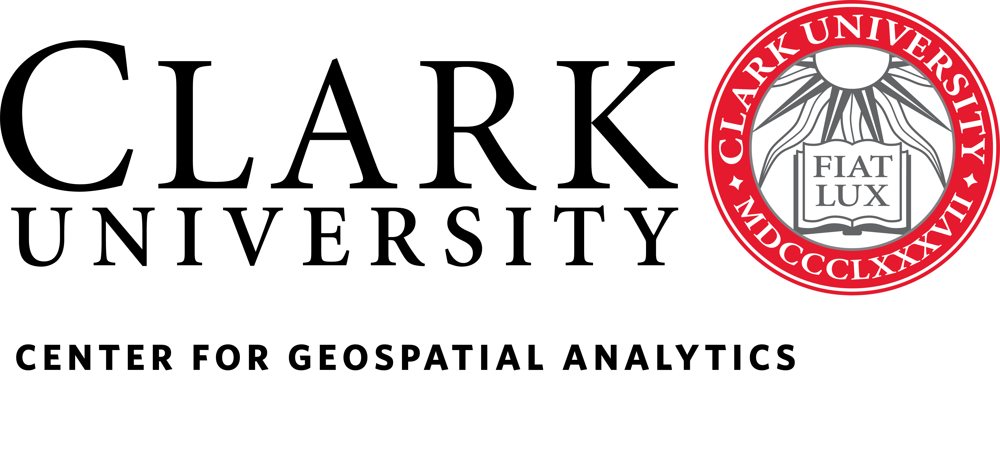

    

Clark Center for Geospatial Analytics (Clark CGA) is an interdisciplinary research center at Clark University in Worcester, MA, USA established to catalyze synergistic research that uses geospatial analytics to address pressing issues of global environmental change. Clark CGA plays an entrepreneurial role at the forefront of the rapidly evolving fields of geospatial analytics and GeoAI. 

The mission of Clark CGA is to drive the progress of geospatial analytics for sustainable environmental stewardship and broader societal benefits. Through innovative scientific research, we develop pioneering geospatial software and technology. Collaborating across disciplines, we address diverse challenges in conservation, climate change impacts, land change modeling, and environmental sustainability. By advancing application tools and technology, our aim is to lead the frontier of geospatial capabilities for societal advancement and environmental resilience.

### __Contact__
Check out our website to learn more about our work: [https://clarku.edu/cga](https://clarku.edu/cga).

Follow Clark CGA on [X](https://x.com/ClarkCGA) and [LinkedIn](https://www.linkedin.com/company/91467992) to hear more about our work. 
